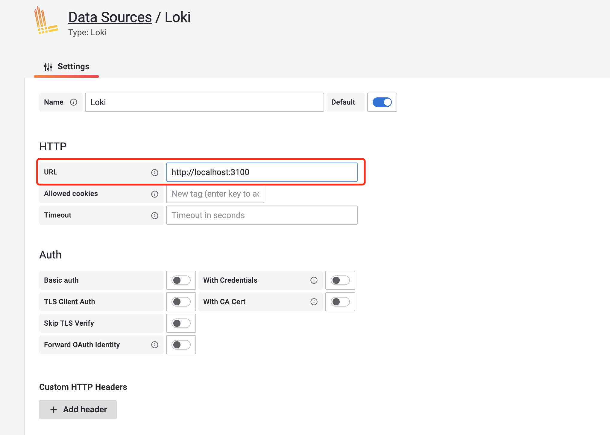
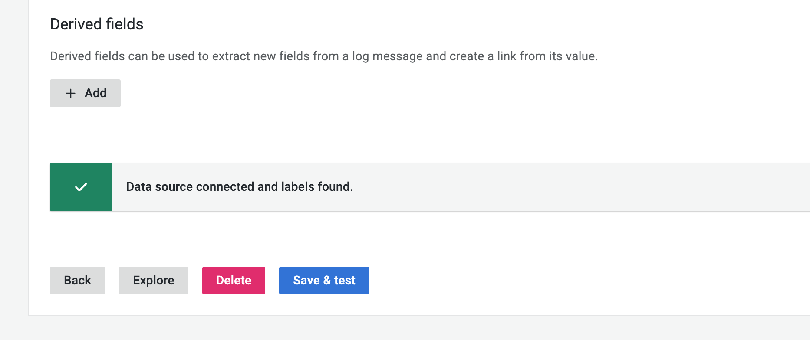
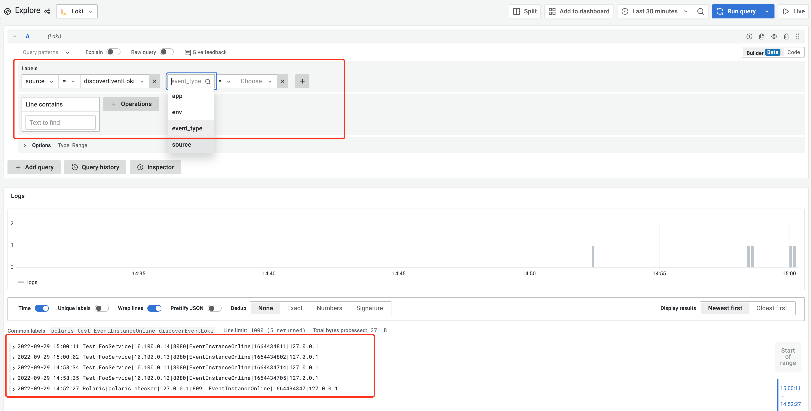

# DiscoverEvent Plugin Loki

[author: alexwanglei](https://github.com/alexwanglei)

English | [中文](./README-zh.md)

The plug-in implements sending service event logs to the Loki log system, and retrieves and visualizes the logs in Loki through Grafana.

## 1. Preparation
### Install and deploy loki

Download binary package
```
$ curl -O -L "https://github.com/grafana/loki/releases/download/v2.6.1/loki-linux-amd64.zip"
# extract the binary
$ unzip "loki-linux-amd64.zip"
# make sure it is executable
$ chmod a+x "loki-linux-amd64"
```
Download configuration file
```
$ wget https://raw.githubusercontent.com/grafana/loki/v2.6.0/cmd/loki/loki-local-config.yaml
```
Run Loki Server
```
$ nohup ./loki-linux-amd64 -config.file=loki-local-config.yaml > ./loki.log 2>&1 &
```
For more installation methods, please refer to [Loki official installation documentation](https://grafana.com/docs/loki/latest/installation/)

### Install and deploy Grafana
RPM package installation
```
$ wget https://dl.grafana.com/enterprise/release/grafana-enterprise-9.1.6-1.x86_64.rpm
$ sudo yum install grafana-enterprise-9.1.6-1.x86_64.rpm
```
Start the Grafana service
```
$ sudo systemctl daemon-reload
$ sudo systemctl start grafana-server
$ sudo systemctl status grafana-server
```
For more installation methods, please refer to [Grafana official installation documentation](https://grafana.com/docs/grafana/latest/setup-grafana/installation/)

## 2. Plug-in configuration and use

### Compile the plugin

1. Git clone https://github.com/polarismesh/polaris.git
2. Go to the polaris directory
3. Execute **go get github.com/polaris-contrib/polaris-server-plugin-discoverevent-loki**
4. Execute **go mod tidy -compat=1.17**
5. Edit polaris/plugin.go, add in the import block
    ```go
    import (
         ...
         _ "github.com/polarismesh/polaris/plugin/discoverevent/loki" # Introduce the plugin and trigger the plugin's automatic registration logic
    )
    ```
6. Execute build.sh to build polaris-server

### enable in polaris-server

In the polaris-server.yaml configuration file, in the plugin configuration section, the discoverEvent plugin configuration block is set as follows:

```YAML
plugin:
  discoverEvent:
    name: discoverEventLoki                              # [必填]插件名称
    option:
      queueSize: 1024                                    # [必填]日志缓存队列长度
      pushURL: http://127.0.0.1:3100/loki/api/v1/push    # [必填]loki push 接口地址
      tenantID: "test"                                   # [可选]设置loki日志租户
      labels:                                            # [可选]自定义日志标签
        key1: "value1"
        key2: "value2"
```
After polaris-server starts, the plugin will be loaded according to the configuration file, and service discovery events will be reported to the Loki log system through the plugin.

## 3. Grafana query Loki log

### Grafana configure Loki data source
Click the configuration icon on the Grafana page, click Data Sources, and add the Loki data source:
- Name: Set the data source name
- URL: set the address of the Loki instance



After the configuration is complete, click the Save & Test button at the bottom of the page. If the Loki system is running and a log is reported to the system, it will prompt that the data source is connected and the tag is found.



### Query Loki logs
Click the Explore button to query the Loki log, and log filtering can be done according to the tag. The plugin will set two tags, `source` and `event_type` by default. The value of `source` is the plugin name `discoverEventLoki`, and `event_type` is the service discovery event type.



For more configuration and usage, please refer to [Using Loki in Grafana](https://grafana.com/docs/grafana/latest/datasources/loki/)

